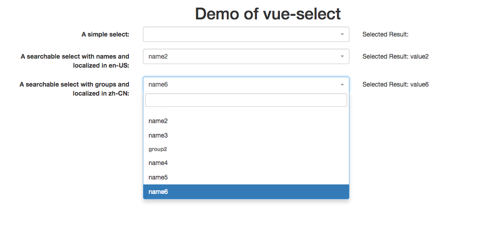

# vue-select

[](https://circleci.com/gh/Haixing-Hu/vue-select/tree/master)
[](https://coveralls.io/github/Haixing-Hu/vue-select?branch=master)
[](https://www.bithound.io/github/Haixing-Hu/vue-select)
[](https://david-dm.org/Haixing-Hu/vue-select)
[](https://david-dm.org/Haixing-Hu/vue-select#info=devDependencies)

A Vue.js component implementing the select control with the [jQuery select2 plugin](https://github.com/select2/select2).

# Demo

The demo page is [HERE](http://haixing-hu.github.io/vue-select/demo.html).



# Requirements

- [Vue.js](https://github.com/yyx990803/vue) `^1.0.24`
- [JQuery](https://github.com/jquery/jquery) `^3.0.0`
- [Select2](https://github.com/select2/select2) `^4.0.3`

# Instllation

## npm

```shell
$ npm install vue-select2
```

## bower

```shell
$ bower install vue-select
```

# Usage

The HTML snippets are as follows:

```html
<div id="app">
  <div class="form-horizontal">
    <div class="form-group">
      <label for="select1" class="col-sm-3 control-label">
        A simple select:
      </label>
      <div class="col-sm-5">
        <vue-select class="vue-select1" name="select1" :options="options1" :model.sync="result1">
        </vue-select>
      </div>
      <div class="col-sm-4">
        <p class="form-control-static">
          Selected Result: <span class="vue-result1">{{result1}}</span>
        </p>
      </div>
    </div>
    <div class="form-group">
      <label for="select2" class="col-sm-3 control-label">
        A searchable select with names and localized in en-US:
      </label>
      <div class="col-sm-5">
        <vue-select class="vue-select2" name="select2"
                :options="options2" :model.sync="result2"
                :searchable="true" language="en-US">
        </vue-select>
      </div>
      <div class="col-sm-4">
        <p class="form-control-static">
          Selected Result: <span class="vue-result2">{{result2}}</span>
        </p>
      </div>
    </div>
    <div class="form-group">
      <label for="select3" class="col-sm-3 control-label">
        A searchable select with groups and localized in zh-CN:
      </label>
      <div class="col-sm-5">
        <vue-select class="vue-select3" name="select3"
                    :options="options3" :model.sync="result3"
                    :searchable="true" language="zh-CN">
        </vue-select>
      </div>
      <div class="col-sm-4">
        <p class="form-control-static">
          Selected Result: <span class="vue-result3">{{result3}}</span>
        </p>
      </div>
    </div>
  </div>
</div>
```

The Javascript snippets are as follows:

```javascript
var vm = new Vue({
  el: "#app",
  components: {
    "vue-select": require("vue-select")
  },
  data: {
    options1: [
      "value1",
      "value2",
      "value3"
    ],
    options2: [{
      text: "name1",
      value: "value1"
    }, {
      text: "name2",
      value: "value2"
    }, {
      text: "name3",
      value: "value3"
    }],
    options3: [{
      label: "group1",
      options: [{
        text: "name1",
        value: "value1"
      }, {
        text: "name2",
        value: "value2"
      }, {
        text: "name3",
        value: "value3"
      }]
    }, {
      label: "group2",
      options: [{
        text: "name4",
        value: "value4"
      }, {
        text: "name5",
        value: "value5"
      }, {
        text: "name6",
        value: "value6"
      }]
    }],
    result1: "",
    result2: "",
    result3: ""
  }
});
```

# Component Properties

## `options`

The array of options of the selection control. It could be

- an array of strings, e.g., `['opt1', 'opt2']`; or
- an array of objects specifying the text and value of each option, e.g.,
  `[{text: 'name1', value: 'val1'}, {text: 'name2', value: 'val2'}]`; or
- an array of objects specifying the option group, e.g.
  ```
  [{
    label: 'group1',
    options: [{text: 'name1', value: 'val1'}, {text: 'name2', value: 'val2'}]
  }, {
    label: 'group2',
    options: [{text: 'name3', value: 'val3'}, {text: 'name4', value: 'val4'}]
  }]
  ```

## `model`

The model bind to the control, which must be a two way binding variable.

Note that the value of model could be set to `null`, and in that case the
selection will be set to nothing. Also, if the selection is set to nothing
(that is, the user delete the text in the input box of the selector), the
value of the model will be set to `null` instead of an empty string.

## `searchable`

The optional flag indicates whether to show the search box.

## `language`

The optional code of language used by the
[select2](https://github.com/select2/select2) plugin.

The supported languages are exactly the same as the supported languages of the
[select2](https://github.com/select2/select2) plugin. In order to use the
supported language, you must also include the corresponding "i18n" js file of
the [select2](https://github.com/select2/select2) plugin in your HTML file.

Note that the language code passed to this property could be a locale code
consists of a language code and a country code, e.g., `"en-US"`. The component
will automatically convert the locale code to the language code supported by
the [select2](https://github.com/select2/select2) plugin. Since some languages
have different variants in different country or region, e.g., `"zh-CN"` for the
simplified Chinese and `"zh-TW"` for the traditional Chinese, it's recommended
to use the locale code in the form of `"[language]-[country]"`.

If this property is not set, and the [vue-i18n](https://github.com/Haixing-Hu/vue-i18n)
plugin is used, the component will use the language code `$language` provided
by the [vue-i18n](https://github.com/Haixing-Hu/vue-i18n) plugin; otherwise, the
component will use the default value `"en-US"`.

## `theme`

The optional name of the theme of the [select2](https://github.com/select2/select2)
plugin. Default value is `'bootstrap'`.

Note that in order to use the bootstrap theme, you must include the CSS file
from the [select2-bootstrap-theme](https://github.com/select2/select2-bootstrap-theme/) project.
And it's very important that the above CSS file must be included AFTER the
CSS file of the bootstrap.

The following is the correct order for including CSS files:

```html
<link rel="stylesheet" type="text/css" href="http://cdn.bootcss.com/select2/4.0.0/css/select2.css">
<link rel="stylesheet" type="text/css" href="http://cdn.bootcss.com/bootstrap/3.3.5/css/bootstrap.css">
<link rel="stylesheet" type="text/css" href="https://select2.github.io/select2-bootstrap-theme/css/select2-bootstrap.css">
```

Check the [demo page](http://haixing-hu.github.io/vue-select/demo.html) for details.

# API

## `control`

This property is a reference to the JQuery selection of the base select
control. It could be used to call the APIs of
[select2](https://github.com/select2/select2) plugin. For example,
`select.control.val(val)` will set the value of the select to the
specified value, where `select` is the reference to the `vue-select`
component.

# Contributing

- Fork it !
- Create your top branch from `dev`: `git branch my-new-topic origin/dev`
- Commit your changes: `git commit -am 'Add some topic'`
- Push to the branch: `git push origin my-new-topic`
- Submit a pull request to `dev` branch of `Haixing-Hu/vue-select` repository !

# Building and Testing

First you should install all depended NPM packages. The NPM packages are used
for building and testing this package.

```shell
$ npm install
```

Then install all depended bower packages. The bower packages are depended by
this packages.

```shell
$ bower install
```

Now you can build the project.
```shell
$ gulp build
```

The following command will test the project.
```shell
$ gulp test
```

The following command will perform the test and generate a coverage report.
```shell
$ gulp test:coverage
```

The following command will perform the test, generate a coverage report, and
upload the coverage report to [coveralls.io](https://coveralls.io/).
```shell
$ gulp test:coveralls
```

You can also run `bower install` and `gulp build` together with the following
command:
```shell
npm build
```

Or run `bower install` and `gulp test:coveralls` together with the following
command:
```shell
npm test
```

# License

[The MIT License](http://opensource.org/licenses/MIT)
